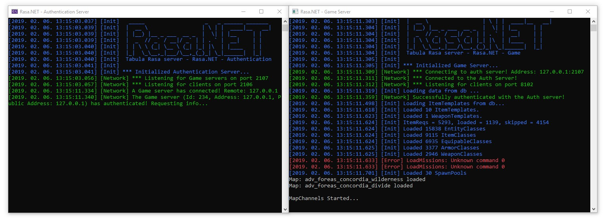

# Rasa.NET
A C# implementation of a game and authentication server for Tabula Rasa running on .NET Core.

## Before you start
This project is in development and not complete. You may not be able to play the game in any capacity. For the latest information, we recommend [joining our Discord](https://discord.gg/Ph68FmA) chat. 

## How-to use this code
There are a few required tools and steps to get everything setup before you can run the game. Follow the steps in the [setup guide](docs/setup.md).

## Contributing
If you are interested in helping in the development of Rasa.NET, please read [join the Discord](https://discord.gg/Ph68FmA) and chat!

## Feedback
- Ask questions and discuss development on [Discord](https://discord.gg/Ph68FmA)
- Submit bugs to GitHub Issues
